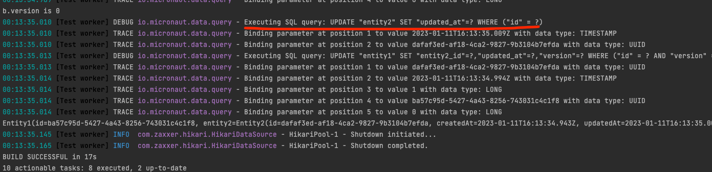

# Micronaut Data Example

## Replay the issue 'How to use optimistic lock version in cascade entity #1960'

https://github.com/micronaut-projects/micronaut-data/discussions/1960

run the test case `entity2 should check version, when update entity1` in VersionTest

See the output on console, the sql updating entity2 have no condition version

